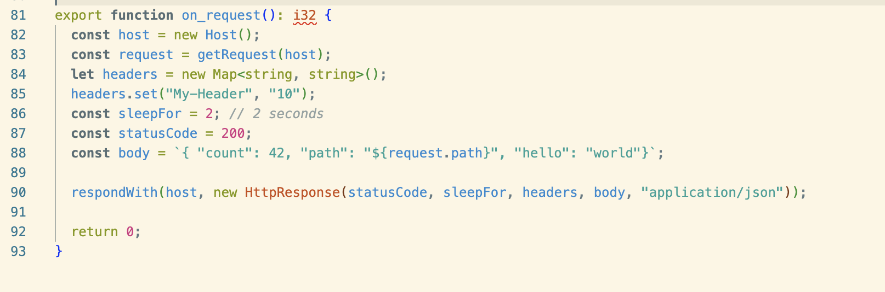
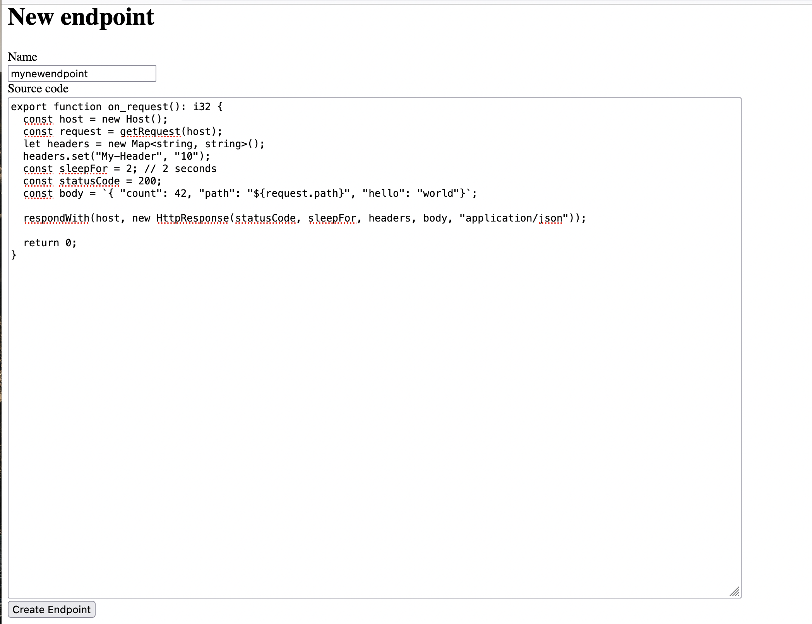
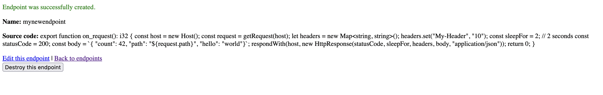

# Extism API Tester

This is a test project to demonstrate the capabilities of the [Extism](https://extism-docs.pages.dev/) plugin development kit.
Extism allows you to safely run user submitted code in your infrastructure. This tool allows users to create custom endpoints by writing an `on_request` callback in [Assemblyscript](https://www.assemblyscript.org/). It's meant to show the power of giving users a plugin system rather than a static configuration screen for a set of rules such as [Beeceptor](https://beeceptor.com/).

Although it's not designed to be this, it's not too dissimilar from [Cloudflare Workers](https://workers.cloudflare.com/) or [Fastly Compute@Edge](https://www.fastly.com/products/edge-compute).



## Usage

You need docker and docker-compose to run this:

### Build

```
docker-compose build
docker-compose run --rm web bundle install -j8
docker-compose run --rm web bundle exec rails db:setup
```

### Run

```
docker-compose up
```

Once running, create a new endpoint by visiting [http://localhost:3000/endpoints/new](http://localhost:3000/endpoints/new).
Choose a name for the endpoint and write the handler code:



Click `Create Endpoint`. If it compiles and saves the endpoint you will see this screeen:




You can now hit the endpoint at `http://localhost:3000/api/:endpoint_name`:

```
$ curl http://localhost:3000/api/mynewendpoint -X GET
{ "count": 42, "path": "/api/myendpoint", "hello": "world"}⏎ 
```

## Architecture

There are 2 services, `web` and `compiler`

### web

The web applicaiton is written in rails and uses scaffold to keep things very easy. Extism comes with host clients in many languages
so using rails was a good test of the ruby client.

### compiler

The compiler service is a node / express service that exposes an enpoint to compile Assemblyscript into wasm. It puts the compiled wasm
into a shared volume at `/wasm`. The API looks like this:

```
curl http://localhost:4000/compile -X POST --data @test.json -H "Content-Type:application/json"
```

The rails Endpoint model has a callback to send the source code over to this service on update.


